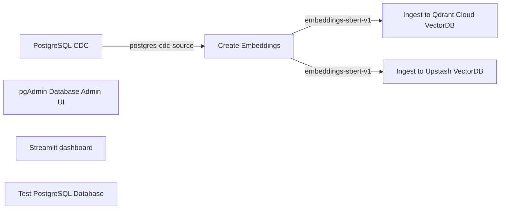

```mermaid
%%{ init: { 'flowchart': { 'curve': 'monotoneX' } } }%%
graph LR;
Create_Embeddings[Create Embeddings] -->|embeddings-sbert-v1|Ingest_to_Qdrant_Cloud_VectorDB[Ingest to Qdrant Cloud VectorDB];
Create_Embeddings[Create Embeddings] -->|embeddings-sbert-v1|Ingest_to_Upstash_VectorDB[Ingest to Upstash VectorDB];
PostgreSQL_CDC[PostgreSQL CDC] -->|postgres-cdc-source|Create_Embeddings[Create Embeddings];
pgAdmin_Database_Admin_UI[pgAdmin Database Admin UI]
Streamlit_dashboard[Streamlit dashboard]
Test_PostgreSQL_Database[Test PostgreSQL Database]

```